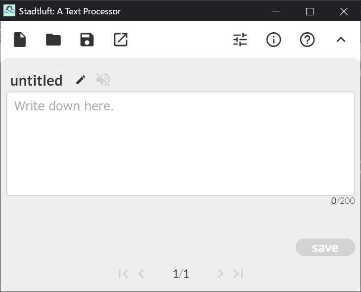
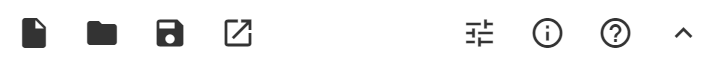
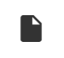
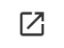
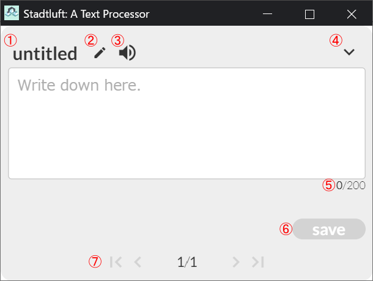

# Stadtluft: A Text Processor

Stadtluft（しゅたっとるふと）はアウトプットに特化したシンプルなテキストプロセッサです。

## Why Stadluft?

書いた文章を何度も読み返して結局前に進まない。そんな経験はありませんか？

+ 文章を何度も何度も推敲することに気をとられて、全体の進捗は思うように行かない

+ あっちが気になったりこっちが気になったりで、結局削ったり直したりばかりで前に進まない

それもこれも、「書くこと」以外に気をとられているからです。

編集したり、推敲することはとりあえず後回しにして、書くことに集中してみませんか。

Stadtluftは「書くこと」に特化したテキストプロセッサです。

「書く」という必要最低限の機能に絞ることで、圧倒的な自由さでアウトプットすることを可能にします。

## How to use

インストールとアンインストール

使用にあたり特別なインストール動作は不要です。zipファイルを解凍してください。

アンインストールする際はフォルダをそのまま削除してください。

### 基本的な動作

stadtluft.exeを起動します。起動には少し時間がかかります。

起動が完了すると以下の画面が表示されます。

"Write down here."と表示されている場所が入力領域です。ここに文を入力します。

+ 一度に入力できるのは1文字以上200文字までです。

+ 文の入力が済んだら右下の"save"のボタンを押すか、Shift+Enter, Ctrl+Enterで文が保存されます。
    + 文が未入力/200文字よりも多い場合は保存できません。
    + 新規ファイルの場合、初回のみ保存ダイアログが表示されますので、ファイル名を指定してください。以後、このファイルに文章が追記されていきます。
+ 保存が完了すると、入力領域が空になり、次の文の入力を受け付けます。
+ あとはひたすら書き進めるだけです。

### その他の機能

#### メニューバー

新規作成

+ 現在開いているファイルの編集をやめ、新しいファイルを開きます。
+ 確認のダイアログは表示されません。

ファイルを開く

+ 既存のファイルを開きます。
+ Stadtluftで作成したファイル(.stlf)の他、テキストファイルも対応しています。

エクスポート

+ 編集中のファイルを所定の形式でエクスポートします。
+ HTMLファイル(.html)、マークダウンファイル(.md)、テキストファイル(.txt)に対応しています。

プレビュー

+ 編集中のファイルをブラウザでプレビューします。

コンフィグ

+ 設定画面を開きます。

Info

+ ファイルの情報を表示します。表示される情報は、タイトル・作成者・作成日・更新日です。

このソフトウェアについて

+ Stadtluftに関する情報を表示します。

メニューを閉じる

+ メニューバーを非表示にします。

#### メイン画面

+ ①タイトル
    + 編集中のファイルのタイトルが表示されます。
+ ②ファイル情報編集
    + タイトルと作成者の情報を編集します。
+ ③サウンドエフェクト
    + 保存時に鳴らす効果音を有効/無効にします。デフォルトでは無効です。
+ ④メニューバーを開く
    + メニューバーを開きます。メニューバーが閉じているときにのみ表示されます。
+ ⑤文字カウント
    + 現在入力中の文字数を表示します。
+ ⑥セーブボタン
    + 入力中の文を保存します。
+ ⑦ページボタン
    + これまで入力した文を振り返ることができます。ただし入力済みの文章を変更することはできません。

## ライセンス

本ソフトウェアは[BSD三条項ライセンス](https://ja.wikipedia.org/wiki/BSD%E3%83%A9%E3%82%A4%E3%82%BB%E3%83%B3%E3%82%B9#%E4%BF%AE%E6%AD%A3BSD%E3%83%A9%E3%82%A4%E3%82%BB%E3%83%B3%E3%82%B9%E3%83%BB%E4%B8%89%E6%9D%A1%E9%A0%85BSD%E3%83%A9%E3%82%A4%E3%82%BB%E3%83%B3%E3%82%B9)に基づいて配布します。

+ 本ソフトウェア無償で使用することができます。
+ 本ソフトウェアは無保証です。本ソフトウェアによって生じた損害について一切責任を負いません。

ライセンスに関する詳細は同梱のLICENSEファイルをご覧ください。

また本ソフトウェアはドネーションウェア(カンパウェア)です。

気に入った方は有料版を購入するなどして支援していただけると助かります。

Copyright (c) 2019,  Café Rainbird   All rights reserved.

